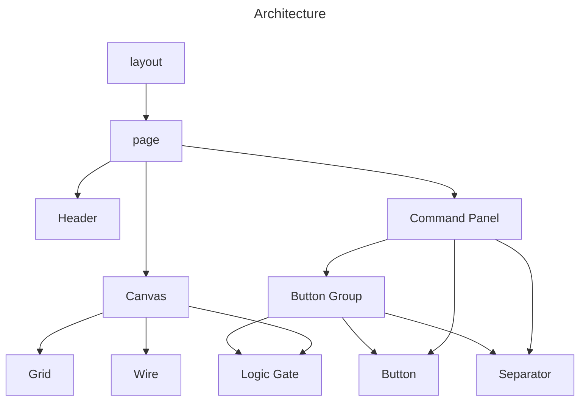

# Digi Gogo - Front-end

This is the front-end of the Digi Gogo project. It is a Next.js application that uses TypeScript and html `canvas` to render the digital circuit simulator. It allows users to visually design digital circuits and simulate their behavior.

## Architecture

Let's summarize the components architecture and the relationships between them:

