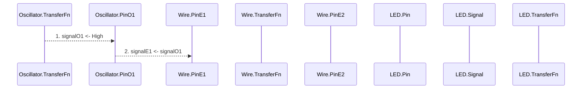

# Digi - Gogo: Digital Circuit Simulator in Go

Digi Gogo is a digital circuit simulator written in Go. It allows you to draw a digital circuits using logic gates, define custom components and see them in action.

INSERT GIF HERE

## Features

Digi Gogo makes it possible to `create digital circuits` using a set of base components, connect them together using wires and buses, and visualize the output using LEDs, 7-segment displays, and more. You can then `save your creations` inside your personnal space, star them on your project page and share them with others.

Digi Gogo also allows you to `define custom components`, change their look & feel, and save them for later use.

## Base Components

Digi Gogo comes with a few base components:

- `sources`
  - a constant signal that can be HIGH or low
  - a clock signal with a parameterizable frequency and duty cycle
  - a pulse generator that creates a pulse of a given duration
- `logic gates`
  - NAND & NOR logic gates which can be used to create any other logic gate
  - AND, OR & NOT logic gates that also allow you to create any other logic gate
- `sinks`
  - simple LEDs to visualize the output of a circuit
  - LED vector/matrix to visualize a 2D array of signals
  - 7-segment display to visualize numbers/letters

## Circuit Design

You can connect these base components together to create complex circuits using the following features:

- `wires and buses` to connect components together
- `switches` allowing you to cut or establish a wire connection at runtime

You can then simulate the circuit and see the output signals on the different components. Once happy with the result, you can:

- save your circuit to your personnal space
- star it on your project page
- share it with the community

## Custom Components

If you want to reuse your circuit as a standalone component, you can define its input and output pins, give it a name, change its look & feel and save it as a component using the following features:

- `pins`: input, output, bidirectional, Hi-Z
- `look & feel`: you can select the name, color & shape of your component using the component properties panel

## Installation

## Architecture

Digi Gogo core implementation is written in Go which is a nice choice for simulating concurrent processing and message exchanges between components. Indeed, Go concurrency patterns, goroutines and channels are a perfect fit for this application. Let's see how we can leverage go language intrinsic properties to simulate a digital circuit.

### Signal & Logic Levels

In a digital circuit, signals can only take three values: `HIGH`, `Low` or `HiZ` (High Impedance). We can represent these values using a type definition:

```go
type LogicLevel int

const (
	Low LogicLevel = iota
	High
	HiZ
)
```

In turn, a signal can be seen as a channel on which logic levels are sent and received. We can define a signal as follow:

```go
type Signal chan LogicLevel
```

### Signal Processing

In a digital circuit, components do only one thing: they process signals and produce new ones. This processing can be represented as a `transfer function` that takes input parameters and returns output values. Let's propose a type definition:

```go
type TransferFn func([]Signal) []Signal
```

This signature is a good start but hides some information. Aside from the input signals, the transfer function may need some additional information to produce the output signals. For instance, a clock signal might need to know the frequency and duty cycle at which it should oscillate. A latch might need to know the current state of its output signal to produce the next state.

Therefore, we can deduce that the `transfer function` should be a method of a `component` that will give access to its internal state and parameters. In other words, a component should conform to the following interface:

```go
type Component interface {
  TransferFn
  GetState() []LogicLevel
}
```

When processing signals, the transfer function will read the input signals from the parameter list, get the current state of the component through the `GetState` method, and produce the output signals.

### Component Communication

In a digital circuit, components are connected together using wires and buses. These connections can be seen as concurrent processes that listen to changes at one of their end and propagate the received signal to their other end.

### Activity Diagram

Let's consider the following use case where we have an oscillator connected with a wire to a LED. Let's skip the setup steps during which we add these elements to the circuit through the UI and focus on the simulation part.

Here is the sequence diagram of the simulation process:


